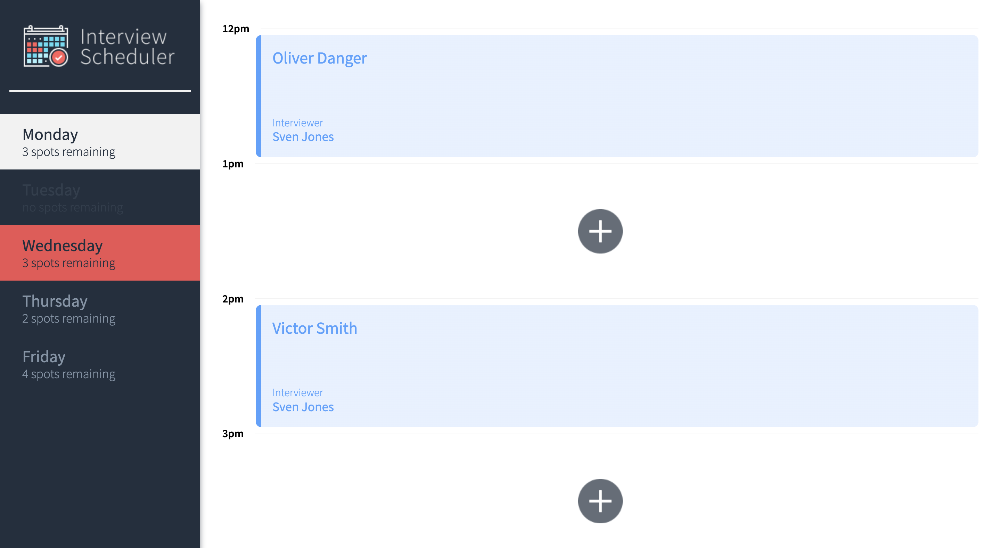
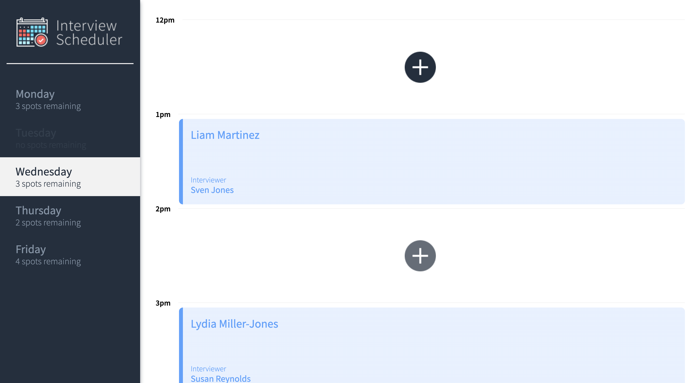
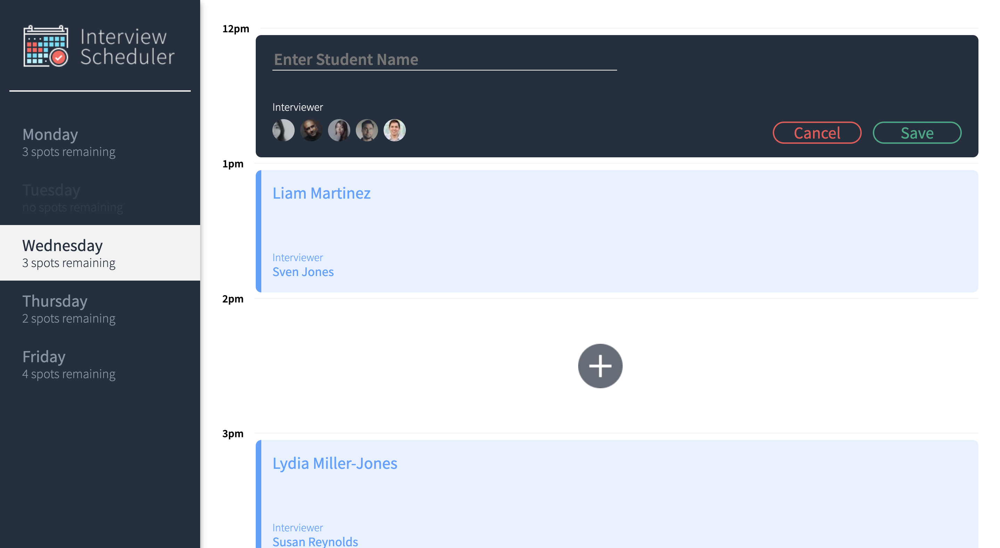
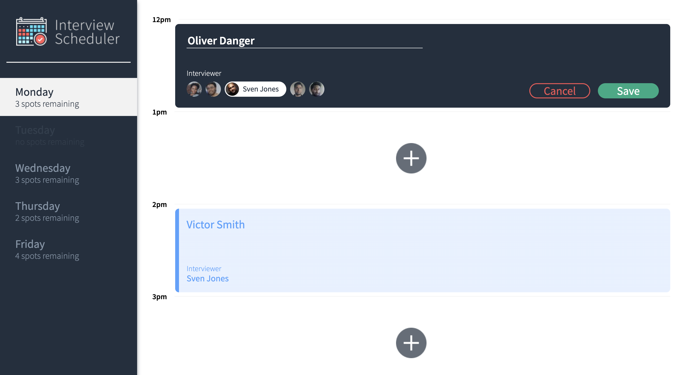
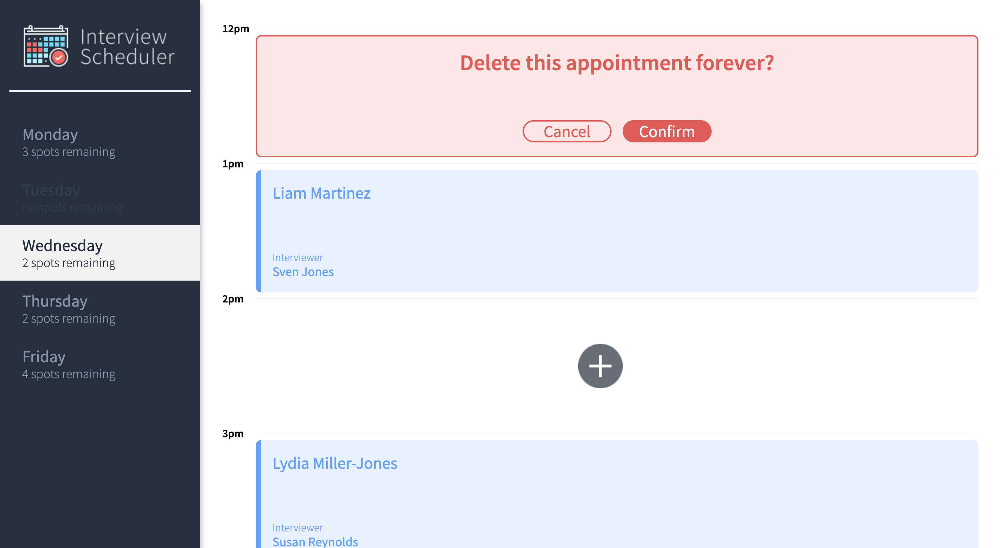

# Interview Scheduler

Welcome to Interview Scheduler

## Screenshot Preview: 
##### Switching to Wednesday's appointments


##### Wednesday's appointments display


##### Scheduling a new appointment


##### Editing an  existing appointment


##### Asking to confirm delete


## Setup

### Dependancies
Install dependencies with `npm install`.

- axios ^0.20.0
- classnames ^2.2.6
- normalize.css ^8.0.1
- react ^16.9.0
- react-dom ^16.9.0
- react-scripts 3.4.4

### Scheduler API

Interview Scheduler requires the [Scheduler API](https://github.com/OliverDanger/scheduler-api) which can be found at:

https://github.com/OliverDanger/scheduler-api

## Running Webpack Development Server

```sh
npm start
```

## Running Jest Test Framework

```sh
npm test
```

## Running Storybook Visual Testbed

```sh
npm run storybook
```

## Running Cypress End to End Tests

```sh
npm run cypress
```